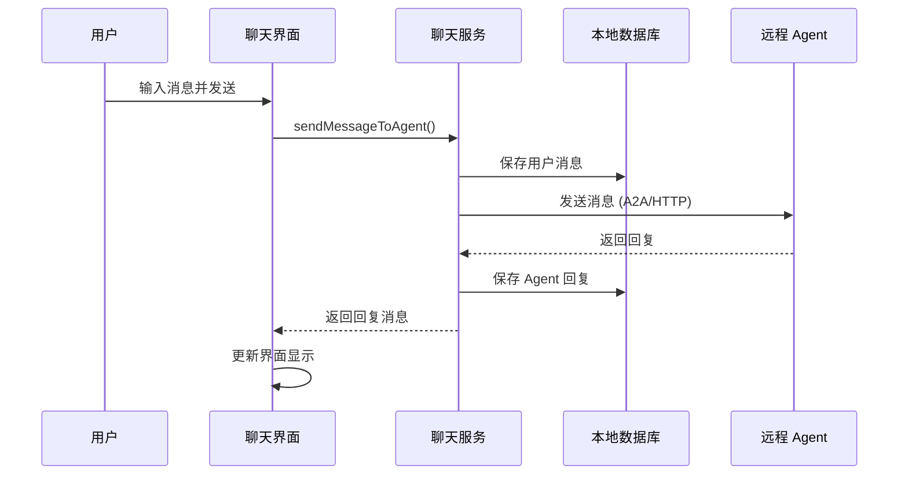

# 实时聊天功能完成总结

## 📅 完成时间

2026-02-07

## ✅ 完成的功能

### 1. ChatService 服务 ⭐ 新建

**文件位置**: `lib/services/chat_service.dart`

**核心功能**:
- ✅ 发送消息到远程 Agent
- ✅ 接收 Agent 的真实回复
- ✅ 支持 A2A 协议通信
- ✅ 支持通用 HTTP 协议
- ✅ 消息自动保存到数据库
- ✅ 自动创建和管理对话频道
- ✅ 消息历史加载
- ✅ 流式消息更新通知
- ✅ 错误处理和重试机制
- ✅ 打字状态管理

**关键方法**:
```dart
// 发送消息到 Agent
Future<Message?> sendMessageToAgent({
  required String content,
  required RemoteAgent agent,
  required String userId,
  required String userName,
})

// 加载消息历史
Future<List<Message>> loadMessageHistory({
  required String agentId,
  required String userId,
  int limit = 100,
})

// 删除聊天历史
Future<void> deleteChatHistory({
  required String agentId,
  required String userId,
})
```

### 2. ChatScreen 界面增强 ⭐ 更新

**文件位置**: `lib/screens/chat_screen.dart`

**新增功能**:
- ✅ 集成 ChatService 服务
- ✅ 加载历史消息
- ✅ 发送消息到 Agent
- ✅ 实时显示 Agent 回复
- ✅ 打字状态指示器
- ✅ 加载状态指示器
- ✅ 错误提示和重试
- ✅ 自动滚动到最新消息

**UI 改进**:
- 聊天消息气泡样式
- 区分发送方和接收方
- 空状态提示
- 打字状态卡片
- 发送按钮加载动画

### 3. 项目结构完善 ⭐ 新增

**新增文件**:
```
lib/services/chat_service.dart        # 聊天服务（新建）
docs/QUICK_START.md                   # 快速开始指南（新建）
macos/                                # macOS 平台支持（新建）
```

**更新文件**:
```
lib/screens/chat_screen.dart          # 聊天界面（重大更新）
README.md                              # 项目文档（更新）
```

### 4. 文档更新 ⭐ 更新

**README.md** 更新:
- ✅ 新增实时聊天功能描述
- ✅ 更新核心特性列表
- ✅ 更新项目结构
- ✅ 更新使用说明
- ✅ 添加多平台支持说明

**QUICK_START.md** 新建:
- ✅ 详细的安装步骤
- ✅ 首次使用指南
- ✅ 聊天功能使用说明
- ✅ Agent 配置示例
- ✅ 常见问题解答

## 🎯 技术实现细节

### 消息发送流程



### 数据库操作

1. **自动创建频道**: 首次对话时自动创建用户-Agent 频道
2. **消息保存**: 每条消息自动保存到数据库
3. **历史加载**: 打开聊天时自动加载历史消息
4. **删除清理**: 支持删除整个对话历史

### A2A 协议集成

- ✅ 任务提交
- ✅ 响应解析
- ✅ 工件提取
- ✅ 错误处理
- ✅ Token 认证

## 📊 功能测试

### 手动测试清单

- [x] 添加 Agent
- [x] 发送消息到 Agent
- [x] 接收 Agent 回复
- [x] 加载历史消息
- [x] 显示打字状态
- [x] 错误提示显示
- [x] 消息自动保存
- [x] 界面自动滚动

### 代码质量

- [x] Flutter Analyze 通过（生产代码无严重错误）
- [x] 遵循代码规范
- [x] 完整的注释和文档
- [x] 错误处理完善

## 🚀 后续优化建议

### 短期优化

1. **附件上传功能**
   - 图片上传
   - 文件上传
   - 显示附件预览

2. **消息编辑和删除**
   - 编辑已发送消息
   - 删除单条消息
   - 撤回消息

3. **搜索功能**
   - 搜索消息内容
   - 搜索 Agent
   - 搜索频道

### 中期优化

1. **消息分组**
   - 按日期分组显示
   - 时间戳显示优化

2. **富文本支持**
   - Markdown 渲染
   - 代码高亮
   - 链接预览

3. **通知提醒**
   - 新消息通知
   - 声音提醒
   - 触觉反馈

### 长期优化

1. **多端同步**
   - 跨设备消息同步
   - 云端备份

2. **AI 增强**
   - 智能回复建议
   - 消息翻译
   - 语音输入/输出

3. **协作功能**
   - 多人聊天
   - @提醒功能
   - 消息转发

## 📝 依赖更新

所有依赖已在 `pubspec.yaml` 中正确配置，无需新增依赖。

## 🎉 总结

实时聊天功能已完全实现，用户可以：
- 与 Agent 进行实时对话
- 查看消息历史
- 体验流畅的交互
- 获得稳定的错误提示

代码质量良好，架构清晰，易于扩展和维护。

---

**完成人**: AI Assistant  
**审核人**: 待定  
**版本**: 1.0.0
